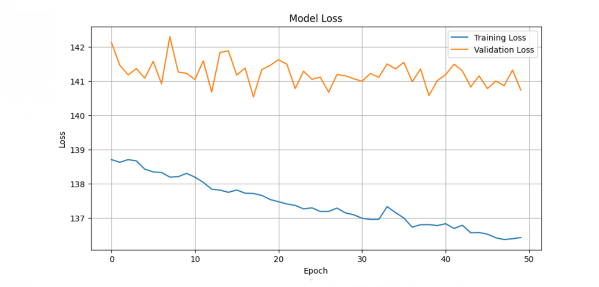
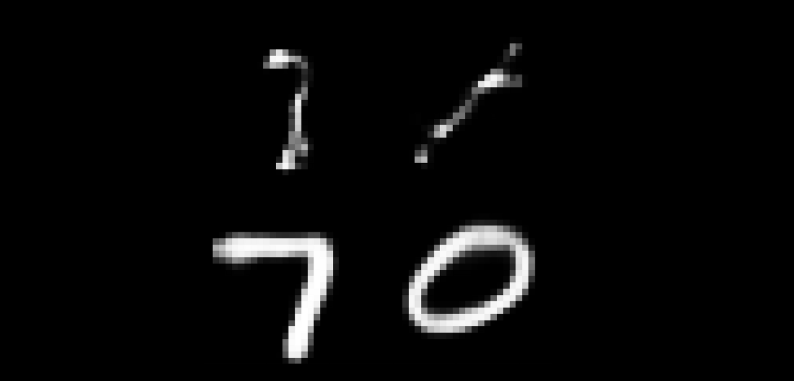

# Handwritten digit generator


## Project Description

This project demonstrates the use of a Variational Autoencoder (VAE) to generate handwritten digits using the MNIST dataset. The VAE is trained on the MNIST dataset, which consists of 60,000 training images and 10,000 testing images of handwritten digits, each image being 28x28 pixels in grayscale. The dataset is normalized to have values between 0 and 1.

## Project Structure

```plaintext
Digit Generation with VAE
│
├── Dataset
│   └── MNIST
│
├── VAE Architecture
│   └── Latent Dimension: 2
│
└── Results
    └── Model Loss Plot
    └── Generated Digits
```

## Architecture

The VAE is built and trained as follows whit MNIST dataset

- **Dataset Loading:** The MNIST dataset is loaded using Keras, and pixel values are normalized.
- **Encoder:** The input images are flattened and passed through two Dense layers with ReLU activation. The encoder outputs the mean and log variance for the latent variables.
- **Sampling Layer:** A sampling function uses the mean and log variance to generate the latent vector.
- **Decoder:** The latent vector is passed through two Dense layers with ReLU activation and then reshaped back to the original image dimensions.
- **Model Compilation:** The VAE is compiled with a custom loss function combining reconstruction loss and KL divergence.
- **Model Training:** The VAE is trained with the training dataset and validated using the test dataset.
- **Image Generation:** New digit images are generated by sampling the latent space and passing the samples through the decoder.

## Learning Curve

The learning curve shows the model's training and validation loss over 50 epochs, indicating how the model's performance improves with training.



## Generated Digits


